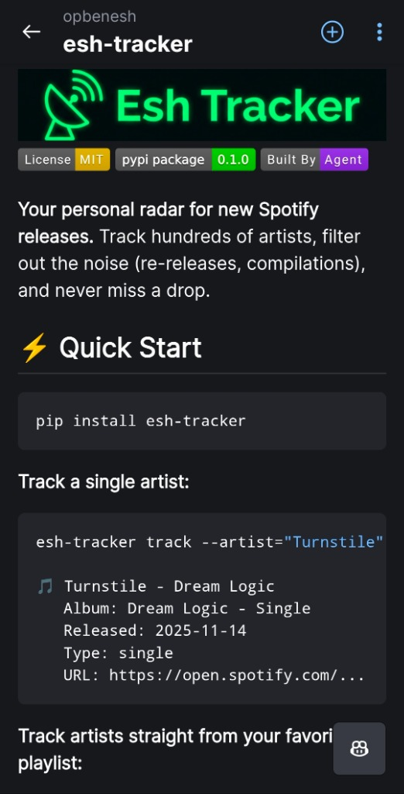
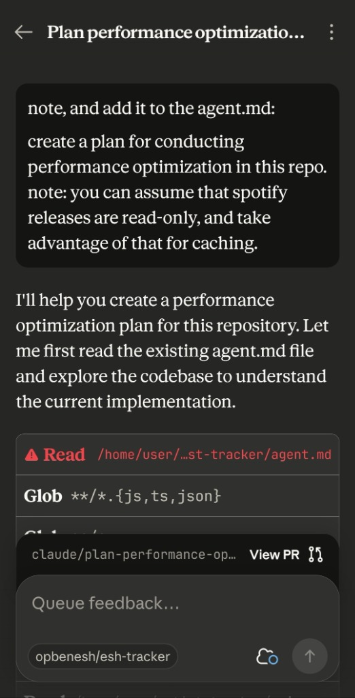

+++
date = '2026-01-11T02:16:16+02:00'
draft = false
title = 'My Unexpected Descent into Doom Coding (or: How I Built a Spotify Tracker App Using My Phone)'
tags = ['coding', 'spotify', 'ai', 'claude', 'doom-coding', 'python']
summary = 'How I built a Spotify release tracker on my phone using Claude Code and vibes.'
[cover]
    image = "result-readme.jpg"
    alt = "Esh Tracker README"
    caption = "Esh Tracker in action"
    relative = true
+++



Hosting a weekly "new metal" show at [KZRadio](https://www.kzradio.net/shows/esh) (hello, shameless plug) means I have an ever-renewing deadline for finding new stuff to play, and Spotify's own Release Radar misses 70% of the good stuff. Introducing [esh-tracker](https://github.com/opbenesh/esh-tracker):

```bash
$ esh-tracker track --artist="Turnstile" --since 2025-10-01

  🎵 Turnstile - Dream Logic
     Album: Dream Logic - Single
     Released: 2025-11-14
     URL: https://open.spotify.com/...
```


Check it out: `pip install esh-tracker` (or check out the [GitHub repository](https://github.com/opbenesh/esh-tracker))!

## ☢️ DOOM CODING for fun and profit

I wanted to revitalize my legacy Spotify release tracker project for a while now, but unfortunately, when I actually find the time that I'm sitting in front of a real-life MacBook, it's usually on the company's dime.

**THAT ALL CHANGED** when I read a Hacker News article titled ["Stop Doom Scrolling, Start Doom Coding"](https://github.com/rberg27/doom-coding) which suggested a remote phone-first vibe coding setup—Claude Code + Tailscale + Android terminal—as a replacement for e.g. checking AP News for the latest political takeovers.

But if I'm already vibe coding, I might as well auto-approve agent code runs, meaning that I definitely don't want the setup running on my local machine (or even a VM on the same network).

Turns out that specific setup is so August 2025. These days, the LLM guys allow you to spin up on-demand sandboxes for their coding services. The Claude Android app even has a native "Code" tab now—just select a GitHub repo, give it a prompt, and go do something else with your day.

So on Friday morning I created an empty GitHub repo, and after a weekend of vibe-Clauding on the go (is this a thing? this should be a thing), I had a fully working app—complete with an AI-generated logo!

And the most surprising thing was that building it was **SO. MUCH. FUN.** The async nature is so perfect for meaningless side-projects like these. I actually vibe-coded at the supermarket and while brushing my teeth. Listen, I love to debate the AI bubble doom scenarios as much as the next guy, but please - you have to try it out. You'll REALLY enjoy it. I promise. I liked it so much I'm writing this blog post at 3am for god's sake.

## 🧑‍🎓 HOW TO DOOM CODE

*   Create an empty, private GitHub repo.

*   (Optional but highly recommended) Brainstorm your planned app with your favorite non-coding LLM and ask it to create a spec.

*   Spin up Claude on your phone, go to the Code tab, and feed it your spec.

    

*   Keep a `CLAUDE.md` file for instructions. Claude reads it before proceeding, so that's a good place to put important stuff about your project, priorities, and environment. Think of it like the "Our Core Values" document you never opened at your previous job!

*   This is a super async process. Rate limits, bus inspectors asking for that QR code, your stew getting burnt, etc. Keep a `TODO.md` file and ask Claude to update it, so that resuming tasks (perhaps even with another agent or environment) is always easy.

*   TDD FTW. Ask Claude to create tests for EVERY SINGLE POSSIBLE SCENARIO, and remind it to run them every once in a while. This is a great way to help the agent understand whether its task is truly done.

*   One conversation per topic. Start a session, give it a few related tasks, review and merge the PR, and move on. Both you and the agent will concentrate better in this model. Learned anything interesting in this session? Great! Update `CLAUDE.md`.

## Assorted TIL 💡

*   Unsurprisingly, auto-approve completely changes the interaction model with these agents. Instead of closely supervising every `rm`, the whole thing becomes truly async. Which means that...
*   Figuring out sandboxes is key to all of this, which is why these new container-first services (Claude Code, Google Jules and OpenAI's Codex) are so great. Let's hope they keep underpricing them!
*   One surprising side effect of the async manner is that you can either use your newly free time for non-coding tasks (e.g. making dinner), but
*   You can also use it for performing *other coding tasks* (hello Jevons paradox!). I ended up spending most of my weekend on this.
*   Also - you _can_ actually use these things for non-coding tasks. Data analysis and research feels like a natural next step - put all your csvs file in a GitHub repo and let it run.
*   Also see Simon Willison's ["The year of programming on my phone"](https://simonwillison.net/2025/Dec/31/the-year-in-llms/#the-year-of-programming-on-my-phone) from his excellent 2025 recap.
